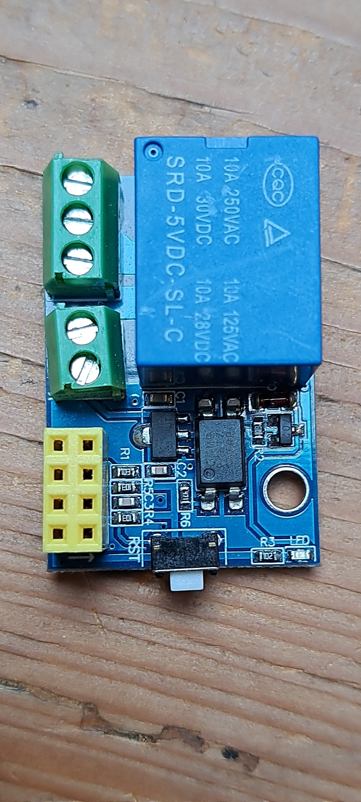
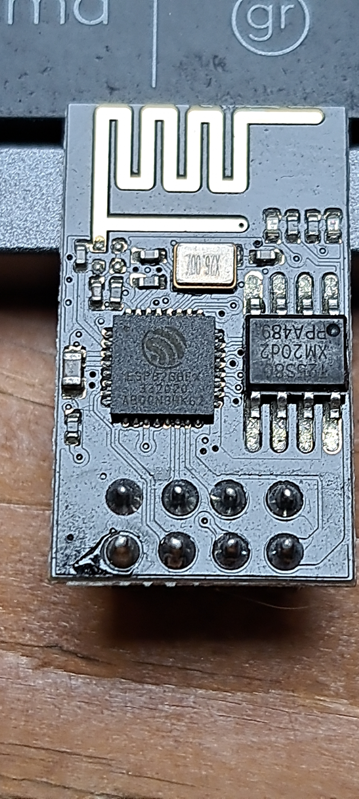
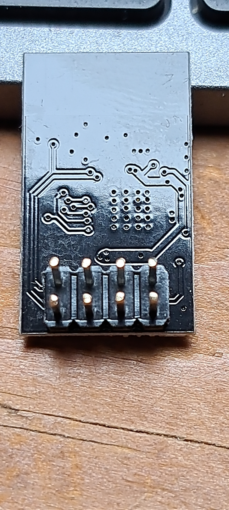
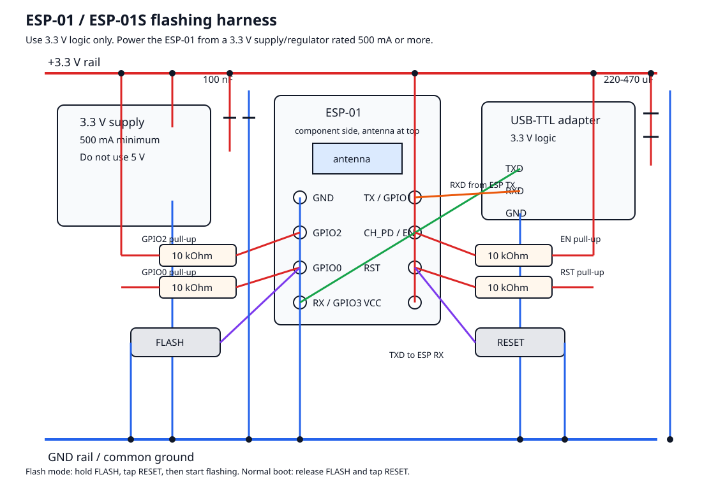

# Greenhouse ESP8266 Relay Controller Design

## Goal

Build a small greenhouse controller for an ESP8266EX relay board. The device reads
temperature and humidity from a DHT11 sensor and drives a fan through the relay
when either value remains above a configured threshold long enough.

The controller must be usable by non-technical users without joining an existing
Wi-Fi network. The ESP8266 will run its own Wi-Fi access point and serve a simple
web UI from the device.

## Hardware Assumptions

- MCU: ESP8266EX or ESP8266 module on an existing relay board.
- Firmware framework: Espressif ESP8266_RTOS_SDK, which is ESP-IDF style for
  ESP8266.
- Language: C.
- Sensor: DHT11 temperature/humidity sensor.
- Output: one relay channel controlling a 230 V AC, 375 W fan.
- Power: regulated 3.3 V for the ESP8266. Relay coil power depends on the relay
  board and must be confirmed from the board markings.

Important hardware notes:

- ESP8266 GPIOs are 3.3 V logic. Do not feed 5 V signals into an ESP8266 GPIO.
- The DHT11 can be powered from 3.3 V if the cable is short. Use a pull-up from
  DATA to 3.3 V, typically 4.7 kOhm to 10 kOhm.
- DHT11 readings are coarse: roughly 1 C and 1 percent RH resolution. It is good
  enough for a first fan controller, but a DHT22/SHT3x/SHT4x would be better if
  precise control matters.
- Any mains wiring for the fan must be isolated and enclosed. Keep low-voltage
  sensor/ESP wiring physically separated from mains wiring.
- The fan is a mains AC motor load. A 375 W fan at 230 V draws about 1.6 A while
  running, but the startup/inrush current can be several times higher.

## Board From Photo







The provided photo appears to be a common ESP-01/ESP-01S 5 V relay carrier:

- Blue relay marked `SRD-5VDC-SL-C`.
- Yellow 2x4 socket for an ESP-01/ESP-01S module.
- One reset button labelled `RST`.
- One 2-pin screw terminal for board power.
- One 3-pin screw terminal for the relay contacts.
- On-board 3.3 V regulator/driver circuitry for the ESP module and relay input.

This board is not the bare ESP8266EX chip board. It expects an ESP-01 or ESP-01S
module to be plugged into the yellow socket. Most versions of this relay carrier
drive the relay from ESP GPIO0, often active-high, but this must be confirmed on
the actual board before final firmware polarity is locked in.

Board-specific constraints:

- Use GPIO2 for the DHT11 DATA line. See "DHT11 Pin Revision" below; this
  replaces the original GPIO1/TX choice.
- Do not use GPIO0 for the DHT11; it is probably the relay control and is also
  the UART flashing boot strap pin.
- The ESP-01 has very few free pins. GPIO0, GPIO1, GPIO2 and GPIO3 are the only
  GPIOs on the header, and three of them are already committed.
- Use an ESP-01S if possible. Many ESP-01S modules include the needed pull-ups on
  EN/CH_PD, RST, GPIO0, and GPIO2, which makes relay boards like this less fussy
  at boot than older ESP-01 modules.
- Power the relay carrier from 5 V at the board power input. The ESP module still
  runs at 3.3 V through the board regulator.

## Proposed Pin Use

Exact pins depend on the relay board. These are safe defaults if available:

| Function | Preferred ESP8266 GPIO | Notes |
| --- | ---: | --- |
| DHT11 DATA | GPIO2 | Pull up to 3.3 V; idles high, which satisfies the boot strap. |
| Relay control | GPIO0 | Common on ESP-01 relay carriers; confirm active level. |
| UART flash RX | GPIO3 / U0RXD | Connect to USB-TTL TX. |
| UART flash TX | GPIO1 / U0TXD | Connect to USB-TTL RX for flashing/debug and serial logging. |
| Boot strap | GPIO0 | Pull low only while resetting to enter UART flashing mode. |
| Boot strap | GPIO2 | Must be high at boot; the DHT11 pull-up holds it there. |
| Boot strap | GPIO15 / MTDO | Must be low at boot; handled inside the ESP-01 module, not on the 8-pin header. |
| Enable | CHIP_EN / EN | Must be high for the chip to run. |
| Reset | EXT_RSTB / RST | Pull low briefly to reset. |

GPIO0, GPIO2, and GPIO15 decide the boot mode. On this board GPIO0 is committed
to the relay, GPIO15 is handled inside the ESP-01 module, and GPIO2 carries the
DHT11 so that GPIO1/TX stays available as a serial console.

### DHT11 Pin Revision

This document originally put the DHT11 on GPIO1/TX "to keep GPIO2 free". Nothing
ever needed GPIO2, so that trade bought nothing and cost the serial console.

The ESP-01 header exposes exactly four GPIOs:

| Pin | Signal | Committed to |
| ---: | --- | --- |
| 5 | GPIO0 | Relay drive on the carrier, and the flash-mode strap |
| 2 | GPIO1 / U0TXD | Serial TX, needed for flashing and logging |
| 7 | GPIO3 / U0RXD | Serial RX, needed for flashing |
| 3 | GPIO2 | Free |

GPIO2 is therefore the only uncommitted GPIO, and it suits a DHT11 well: the boot
straps require GPIO2 to be high at boot, and a DHT11 data line with its pull-up
idles high, so the sensor satisfies the strap instead of fighting it.

One thing must be confirmed on the actual board before this is final. A minority
of ESP-01 relay carriers drive the relay from GPIO2 rather than GPIO0. On such a
board GPIO2 is not free, the DHT11 start pulse would click the relay on every
reading, and the sensor has to go back to GPIO1/TX. Check with a continuity meter
between the relay driver input and the socket pins before final assembly.

The firmware does not hard-code this. `CONFIG_GREENHOUSE_DHT11_GPIO` selects the
pin, defaulting to 2.

## Sensor Wiring

For the common bare 4-pin DHT11 package:

```text
DHT11 pin 1 VDD   -> ESP 3V3
DHT11 pin 2 DATA  -> ESP GPIO2
DHT11 pin 3 NC    -> not connected
DHT11 pin 4 GND   -> ESP GND

4.7k-10k resistor -> between DATA and 3V3
100 nF capacitor  -> between VDD and GND near the sensor, optional but recommended
```

For a 3-pin DHT11 module:

```text
Module VCC -> ESP 3V3
Module DATA/S -> ESP GPIO2
Module GND -> ESP GND
```

Many modules already include the pull-up resistor.

For this relay carrier, GPIO2 is available only on the ESP-01 socket. The
cleanest build is usually to solder a small wire to the ESP-01 TX pin, or use a
small ESP-01 breakout/interposer between the ESP module and yellow socket. Avoid
long sensor cable runs inside a humid greenhouse enclosure.

Caveats:

- The DHT11 DATA line should have only a pull-up to 3.3 V and should not be driven
  by other circuitry.
- The internal ESP8266 pull-up is weak. Fit the external 4.7k-10k resistor or the
  rising edges are too slow to decode reliably.
- GPIO2 must be high at reset. If the sensor or its wiring ever holds the line
  low, the module will not boot. Unplug the DATA wire to test for this.
- If the DHT11 is moved to GPIO1/TX instead, serial logging must be disabled and
  the DATA wire has to come off during flashing. The web UI is then the only
  console.

## Sensor Signal Integrity

Status: **resolved**. Root cause was the supply feeding the regulator, not the
sensor, the decoder, or RF. Kept in full because the diagnosis took several
rounds and the intermediate states are each worth recognising.

### Symptom

With the DHT11 on GPIO2 and the SoftAP running, humidity readings alternate
between two levels on a near every-other-reading pattern. Temperature was also
affected at first. Readings are stable when the radio is off.

### What was ruled out

The decoder and the wiring are not at fault, and this was established rather than
assumed. The firmware logs the raw five-byte frame and the measured high-pulse
width of all 40 bits (see `dht11_last_frame`). Across every sample:

- Zero bits measured 22-24 us, one bits 68-72 us, against a 45 us threshold.
- No bit ever landed near the threshold.
- Every checksum was valid, and the values were internally consistent.

A weak pull-up would shorten the one pulses; slow edges would scatter the widths.
Neither happened. The sensor was faithfully transmitting a measurement that was
itself wrong, so the fault is upstream of the data line.

The sensor itself is also good: with the radio off it tracked a breath smoothly
through intermediate values and settled at the new level.

### Bench experiment log

Setup: ESP-01S on breadboard, LD1117A 3.3 V regulator, DHT11 on GPIO2 a few
centimetres from the module.

| Configuration | Temperature | Humidity |
| --- | --- | --- |
| Wi-Fi on, no capacitors | 26-28 C, occasional 21/30 excursions | alternating 17 / 45, plus timeouts and all-zero frames |
| Wi-Fi **off**, no capacitors | steady 26-27 C | steady 19-20, +/- 1 percent |
| Wi-Fi on, 10 uF at regulator output | 26-27 C, still 21/30 excursions | alternating 18 / 29 / 42, no timeouts, no zero frames |
| Wi-Fi on, 10 uF at regulator + 470 uF at ESP-01 pins | steady 26-27 C | alternating 17 / 37-39 |

Readings taken with `CONFIG_GREENHOUSE_DIAG_NO_WIFI` for the radio-off row.

### What the log shows

Two distinct mechanisms, addressed in sequence:

1. **Regulator loop instability.** LD1117-family parts require a minimum 10 uF
   output capacitor; without one the loop has no phase margin and misbehaves on
   a pulsed load. Fitting it removed the timeouts and the all-zero frames, which
   were the DHT11 browning out and resetting.

2. **Missing local charge reservoir.** A capacitor at the regulator is separated
   from the load by the interconnect. Roughly 10 cm of breadboard wiring is on
   the order of 100 nH, and an ESP8266 PA current step of ~300 mA in a few
   hundred nanoseconds develops on the order of 100 mV to several hundred mV
   across that inductance regardless of how much capacitance sits at the
   regulator. Fitting 470 uF at the ESP-01 VCC/GND pins stabilised temperature.

The residual humidity alternation survived both, and was eventually traced to
the **input side of the regulator**. The bench rig powered the LD1117A from the
USB-TTL adapter's 5 V. That rail sags under the ESP8266's transmit peaks, and the
LD1117 needs at least ~4.5 V in to hold 3.3 V out given its 1.1-1.2 V dropout. So
the regulator was being starved into dropout on every burst. Moving to an
external bench supply, changing nothing else, produced stable humidity readings.

An RF-ingress hypothesis was entertained at the point where temperature had
steadied but humidity had not, reasoning that the capacitive humidity element
would be more susceptible than the thermistor. That reasoning was wrong here: the
same asymmetry is produced by supply sag, because the humidity element measures
against the rail. Recorded because the hypothesis was plausible and the
distinguishing test (moving the sensor away from the antenna) was never needed -
swapping the supply answered it first.

### Root cause

The 5 V source feeding the 3.3 V regulator, not the regulator and not the sensor.
A USB-TTL adapter cannot supply an ESP8266's transmit peaks, and the shortfall
appears at the far end as a sensor reading that is wrong rather than as anything
that looks like a power fault.

Consequences for the product:

- The relay carrier's 5 V input needs a real supply, sized for ESP8266 transmit
  peaks plus the relay coil. Do not power a deployed unit from a computer's USB
  port or from a serial adapter.
- Keep the capacitors. They were each necessary and neither was sufficient: the
  10 uF for regulator stability, the 470 uF as the local reservoir the regulator
  is too slow to substitute for.
- Symptoms to recognise, in escalating order of supply trouble: humidity wrong
  while temperature is fine; temperature also excursion-prone; read timeouts;
  all-zero frames. They appear in that order as the supply gets worse, and
  disappear in reverse order as it improves.

### Still worth doing

1. **Fit 100 nF at the DHT11 VDD/GND.** Cheap, and it was never actually tested
   in isolation.
2. **Reduce Wi-Fi transmit power.** `CONFIG_ESP8266_PHY_MAX_WIFI_TX_POWER`
   defaults to the 20 dBm maximum; 10 is ample across a greenhouse and lowers the
   current peak that started all of this.
3. **Confirm on the real carrier.** The bench result was obtained with the
   module on a breadboard and an external supply. Re-check once it is in the
   carrier on its intended supply.
4. **Relay transient.** The relay coil shares the 5 V rail feeding the 3.3 V
   regulator. An SRD-5VDC coil draws 70-80 mA and switches abruptly, with flyback
   on release. Check that a humidity sample taken immediately after the relay
   energises is still plausible. This is expected to be minor, because the
   control model switches the relay rarely and requires sustained readings before
   acting, but it should be observed rather than assumed.

### Why filtering was not the answer

Worth keeping as a note on method. A median or outlier filter was tempting
throughout and would not have worked: the corruption alternated roughly 50/50
between two levels, so a median over any short window is as unstable as the raw
data. Worse, the history chart averages each 5-minute bucket, and the mean of a
17/38 alternation is a smooth, plausible ~27 that the sensor never reported - the
aggregation would have hidden the fault rather than revealed it. The readings had
to be made correct. A plausibility filter is still worth adding as defence in
depth once the relay is live, but it would have buried this bug for weeks.

### Firmware guards already in place

- All-zero frames are rejected. They satisfy the checksum trivially
  (0+0+0+0 == 0) and decode as 0 C / 0 %RH, which a fan controller would read as
  "cold and dry, do not ventilate" - the most dangerous possible misreading. The
  sensor emits these after a reset, so they were a real consequence of the
  brownouts above.
- Humidity above 100 percent is rejected as impossible.
- Readings outside the DHT11's rated 20-90 %RH and 0-50 C are logged as
  unreliable but not discarded, since a greenhouse can genuinely sit outside the
  range the part can measure.
- `CONFIG_GREENHOUSE_DIAG_NO_WIFI` builds a sensor-only image. Reach for it
  whenever sensor behaviour changes once the radio comes up; it is what made the
  diagnosis possible.

### Build guidance regardless of outcome

- Do not run the ESP8266 from a USB-TTL adapter's 3.3 V pin while Wi-Fi is on.
  Those regulators commonly supply 50 mA; an ESP8266 transmitting peaks near
  300 mA.
- Ample regulator current rating is not sufficient on its own. The bench LD1117A
  is good for ~800 mA and still failed.
- Placement matters as much as value. Short legs at the pins. Decoupling
  guidance is phrased as "close to the pin" rather than as a value for a reason.
- Keep the DHT11 leads short and away from the module's antenna.

## Fan Relay Wiring

The fan to control is 230 V AC, 375 W:

```text
Running current = 375 W / 230 V = about 1.63 A
Startup current = higher, commonly several times the running current
```

The blue relay is marked `SRD-5VDC-SL-C` and `10A 250VAC`, but that rating is
normally for resistive loads. A fan motor is an inductive load, so the relay
contacts have a harder job when starting and stopping the fan. For a greenhouse
controller that other people will use, the safer design is:

- Put all mains wiring in a closed insulated enclosure with strain relief.
- Switch the live wire only; never switch protective earth.
- Keep the low-voltage ESP/DHT wiring separated from the 230 V wiring.
- Add an appropriately rated fuse before the relay/load.
- Consider using this relay board only as a control signal for a DIN-rail
  contactor or motor-rated relay if the fan has a high startup surge.
- Consider an RC snubber or MOV rated for 230 V AC across the fan or relay
  contacts to reduce contact arcing from the motor load.
- Have the final mains wiring checked by someone qualified for local electrical
  rules.

For a typical single-channel relay:

```text
ESP relay GPIO -> relay driver input already on board
ESP GND        -> relay board logic GND
230 V live in  -> fuse -> relay COM
Relay NO       -> fan live input, fan normally off
230 V neutral  -> fan neutral directly
Protective earth -> fan earth directly, if the fan has earth
Relay NC       -> unused for normally-off fan
```

Use `NO` for a fan that should be off when the controller is unpowered or crashed.
Confirm whether the relay input is active-high or active-low during board bring-up.
The firmware should expose this as a compile-time or stored setting.

For the photographed board, the top 3-pin screw terminal is the relay contact
terminal. The board silkscreen is partly hidden by the connector, so identify
`NO`, `COM`, and `NC` with a continuity meter before wiring the fan. With the board
unpowered, `COM` and `NC` are connected; `COM` and `NO` connect only when the
relay is energized.

## Flashing Wiring

Use a 3.3 V USB-to-TTL serial adapter. Do not use a 5 V UART adapter.

The photographed relay carrier has a reset button but does not appear to have a
flash/program button. To flash the ESP-01 module you normally remove it from the
yellow socket and use an ESP-01 USB programmer or a breadboard wiring harness.

The most important flashing rule: connect `GPIO0` to `GND` only while entering
UART flashing mode and while flashing. Remove that connection afterward, then
reset the ESP-01 so it can boot normally.

Recommended parts for a breadboard flashing harness:

| Part | Value / type | Purpose |
| --- | --- | --- |
| USB-to-TTL adapter | 3.3 V logic | Serial flashing. |
| 3.3 V regulator/supply | 500 mA or more | Powers ESP-01 reliably. |
| Pull-up resistors | 10 kOhm x4 | For `CH_PD`, `RST`, `GPIO0`, `GPIO2`. |
| Reset button | Momentary normally-open | Pulls `RST` to GND. |
| Flash button | Momentary normally-open | Pulls `GPIO0` to GND for flashing. |
| Decoupling capacitor | 100 nF ceramic | Across `VCC` and `GND` near ESP-01. |
| Bulk capacitor | 220 uF to 470 uF electrolytic | Across `VCC` and `GND` near ESP-01. |

Capacitors are strongly recommended. The ESP8266 can draw short Wi-Fi current
spikes that make weak USB-TTL 3.3 V rails sag. When that happens, flashing may
fail, the ESP may reset, or the serial log may show garbage. Put the capacitors
physically close to the ESP-01 `VCC` and `GND` pins:

```text
3.3 V rail ----+---------------------> ESP-01 VCC
               |
              === 100 nF ceramic
               |
              === 220-470 uF electrolytic
               |
GND rail ------+---------------------> ESP-01 GND

Electrolytic polarity:
  capacitor + leg -> 3.3 V rail
  capacitor - leg -> GND rail
```

Minimal flashing wiring can work like this:

```text
FTDI 3.3 V -> ESP VCC and CH_PD/EN
FTDI GND   -> ESP GND and GPIO0 during flashing
FTDI TX    -> ESP RX
FTDI RX    -> ESP TX
```

Recommended flashing wiring adds stability and easier boot-mode control:

```text
3.3 V supply -> ESP VCC
GND          -> ESP GND
10 kOhm      -> CH_PD/EN to 3.3 V
10 kOhm      -> RST to 3.3 V
10 kOhm      -> GPIO0 to 3.3 V
10 kOhm      -> GPIO2 to 3.3 V
RESET button -> RST to GND
FLASH button -> GPIO0 to GND
100 nF       -> VCC to GND, close to ESP-01
220-470 uF   -> VCC to GND, close to ESP-01
```

Typical ESP-01/ESP-01S module pinout, viewed from the component side with the PCB
antenna at the top and the 2x4 pins at the bottom:

```text
        antenna
   +----------------+
   | GND       TX   |
   | GPIO2     CHPD |
   | GPIO0     RST  |
   | RX        VCC  |
   +----------------+
        pins
```

Verify against the module silkscreen before connecting power.

Complete breadboard flashing schema:



```text
                         3.3 V REGULATED SUPPLY
                         500 mA minimum
                         +3V3 rail                         GND rail
                            |                                  |
                            |                                  |
                         [100 nF]                          common GND
                         [220-470 uF]
                            |                                  |
                            +----------------------------------+

ESP-01 / ESP-01S, component side, antenna at top:

        antenna
   +----------------+
   | GND       TX   |-----> USB-TTL RXD
   | GPIO2     CHPD |--+-- 10 kOhm -- +3V3
   | GPIO0     RST  |--+-- 10 kOhm -- +3V3
   | RX        VCC  |---- +3V3
   +----------------+
      |  |      |
      |  |      +-- RESET button -- GND
      |  +--------- 10 kOhm -- +3V3
      |            FLASH button -- GND
      +------------ 10 kOhm -- +3V3

USB-TTL TXD --------------------------> ESP-01 RX
USB-TTL RXD <-------------------------- ESP-01 TX
USB-TTL GND --------------------------- GND rail

ESP-01 GND ---------------------------- GND rail
```

Same wiring as a checklist:

```text
3.3 V supply +      -> ESP-01 VCC
3.3 V supply GND    -> ESP-01 GND and USB-TTL GND
USB-TTL TXD         -> ESP-01 RX / GPIO3 / U0RXD
USB-TTL RXD         -> ESP-01 TX / GPIO1 / U0TXD
CH_PD / EN          -> 10 kOhm pull-up to 3.3 V
RST                 -> 10 kOhm pull-up to 3.3 V, reset button to GND
GPIO0               -> 10 kOhm pull-up to 3.3 V, flash button to GND
GPIO2               -> 10 kOhm pull-up to 3.3 V
100 nF capacitor    -> between VCC and GND near ESP-01
220-470 uF capacitor -> between VCC and GND near ESP-01
```

Minimal FTDI/USB-TTL mapping, matching the common ESP-01 flashing diagram:

```text
ESP-01 pin 1 GND       -> FTDI GND
ESP-01 pin 2 TX        -> FTDI RX
ESP-01 pin 3 GPIO2     -> not connected, or 10 kOhm pull-up to 3.3 V
ESP-01 pin 4 CH_PD/EN  -> FTDI VCC / 3.3 V
ESP-01 pin 5 GPIO0     -> GND only for flashing
ESP-01 pin 6 RST       -> not connected, or reset button to GND with pull-up
ESP-01 pin 7 RX        -> FTDI TX
ESP-01 pin 8 VCC/3.3V  -> FTDI VCC / 3.3 V
```

If the FTDI adapter cannot supply stable 3.3 V current, use a separate 3.3 V
regulator/supply and connect all grounds together.

Manual flash sequence:

1. Remove the ESP-01/ESP-01S module from the relay carrier.
2. Put it in the breadboard flashing harness.
3. Disconnect the DHT11 DATA wire if it is already attached.
4. Hold the `FLASH` button so `GPIO0` is connected to GND.
5. Tap the `RESET` button so `RST` briefly connects to GND.
6. Release `RESET`; keep `FLASH` held until the flashing tool starts connecting.
7. Run `make flash ESPPORT=/dev/ttyUSB0`.
8. Release `FLASH` and tap `RESET` again to boot the firmware normally.
9. Put the ESP-01/ESP-01S module back into the relay carrier.

Normal boot strap levels:

```text
CH_PD / EN = high
RST        = high
GPIO0      = high
GPIO2      = high
```

UART download/flash mode:

```text
CH_PD / EN = high
RST        = high after reset pulse
GPIO0      = low during reset
GPIO2      = high
```

If the board has buttons labelled `FLASH` and `RST`, hold `FLASH`, tap `RST`,
then release `FLASH` after the flashing tool connects.

## Software Architecture

Use small FreeRTOS tasks with queues/shared state protected by a mutex.

```text
app_main
  |
  +-- config_load()
  +-- gpio/relay init
  +-- dht task
  +-- controller task
  +-- softAP + HTTP server task
  +-- status LED/logging, optional
```

Main modules:

| Module | Responsibility |
| --- | --- |
| `config` | Load/save thresholds and timings in NVS. Validate bounds. |
| `dht` | Bit-banged DHT11/DHT22 driver with checksum and timeout handling. |
| `relay` | Abstract active-high/active-low relay drive and fail-safe off. |
| `controller` | Decide fan state from sensor readings and timing rules. |
| `wifi_ap` | Start SoftAP with local-only SSID and password. |
| `web` | Serve status page, config form, JSON status API, save endpoint. |

## Control Model

Configurable values:

| Setting | Suggested default | Bounds |
| --- | ---: | ---: |
| Temperature threshold | 30 C | 0-50 C |
| Humidity threshold | 80 percent RH | 20-95 percent RH |
| Start delay | 120 s | 0-3600 s |
| Max fan duration | 900 s | 30-7200 s |
| Grace period | 300 s | 0-7200 s |
| Sensor poll interval | 5 s | 2-60 s |
| Relay polarity | verify on board, likely active-high | active-low/high |
| Fan mode | auto | off / auto / on |
| Device name | "Fan" | 1-23 bytes, no quotes/backslashes/controls |
| AP SSID | empty, derived from MAC | 0-32 bytes, same character rules |
| Temperature trigger | enabled | on/off |
| Humidity trigger | enabled | on/off |

State machine:

`fan_mode` selects between forced off, automatic, and forced on. A forced mode
bypasses the state machine entirely:

- Timers do not advance while forced. Returning to auto restarts the machine from
  IDLE rather than resuming frozen timers.
- The sensor-fault override does not apply. In a forced mode the reading is not
  part of the decision, so losing it is not a reason to change the fan.
- `max_fan_duration_s` does not apply to forced on. That limit exists to bound
  *automatic* control when a sensor sticks or a door is left open; an explicit
  operator choice is not the case it guards against. A forced-on fan therefore
  runs until someone changes the mode, which the UI states plainly.
- The mode is stored in NVS, so it survives a reboot. A unit left forced on comes
  back forced on.

Either input can be removed from the decision with `temp_enabled` /
`humidity_enabled` while still being measured and charted. A disabled input never
reads as high. With both disabled the fan cannot start automatically; this is
permitted but reported in the status so it is not mistaken for a fault.

```text
MANUAL_OFF     fan_mode = off; relay off, conditions ignored
MANUAL_ON      fan_mode = on;  relay on, conditions ignored

IDLE
  if temp_high or humidity_high -> WAITING

WAITING
  if values normal -> IDLE
  if high continuously for start_delay -> FAN_ON

FAN_ON
  relay on
  if values normal -> GRACE
  if max_fan_duration reached -> GRACE_FORCED

GRACE
  relay remains on for grace_period
  if values high again -> FAN_ON
  if grace expires and values normal -> IDLE

GRACE_FORCED
  relay off during grace/cooldown
  ignore new high trigger until grace expires, then return to IDLE/WAITING
```

Rationale:

- `start_delay` avoids relay chatter from a single bad DHT11 reading.
- `max_fan_duration` prevents a stuck sensor or open greenhouse door from running
  the fan forever.
- `grace_period` avoids rapid cycling and gives the air time to mix.
- Forced max-duration cooldown turns the fan off, unlike normal grace, because it
  protects the fan and relay from indefinite operation.

Sensor failure policy:

- Ignore isolated checksum/timeouts.
- If sensor has no valid reading for 60 seconds, turn relay off and show an error.
- Keep the AP and web UI available so the user can diagnose wiring.

## Web Interface

Access point:

- SSID: configurable via `ap_ssid`. Empty means `Greenhouse-XXXX`, where `XXXX`
  is the last two bytes of the MAC address, so units stay distinguishable out of
  the box. Changes apply on restart.
- WPA2 password: generated default printed on the device label, or initial default
  changed on first setup.
- IP address: `192.168.4.1`.

Pages/API:

| Path | Method | Purpose |
| --- | --- | --- |
| `/` | GET | Single-page status and settings UI. |
| `/api/status` | GET | JSON: reading, relay state, timers, errors. |
| `/api/config` | GET | JSON: current config. |
| `/api/config` | POST | Save config to NVS after validation. |
| `/api/history` | GET | Downsampled sensor history for the chart, streamed in chunks. |
| `/api/relay/test` | POST | Momentary relay test, guarded by max 5 seconds. |
| `/api/reboot` | POST | Restart, deferred so the response is delivered first. |

The UI should be plain HTML/CSS/JS embedded as static strings or compressed assets.
Avoid frontend frameworks to keep flash and RAM usage low.

## Persistence

Use NVS with a versioned config struct:

```c
typedef struct {
    uint32_t version;
    int16_t temp_threshold_c;
    uint8_t humidity_threshold_pct;
    uint16_t start_delay_s;
    uint16_t max_fan_duration_s;
    uint16_t grace_period_s;
    uint8_t sensor_poll_interval_s;
    bool relay_active_low;
    bool temp_enabled;
    bool humidity_enabled;
} greenhouse_config_t;
```

On boot:

1. Load config from NVS.
2. If missing or corrupt, write defaults.
3. If written by an older version, migrate it rather than discarding the user's
   settings. Version 1 predates the `temp_enabled`/`humidity_enabled` flags; it
   is recognised by its length and carried forward with both inputs enabled,
   which is how version 1 always behaved.
4. Validate all fields before use, including migrated ones.

## Docker-Based Toolchain

Modern official ESP-IDF Docker images target current ESP32-family ESP-IDF releases,
not ESP8266. For ESP8266, use Espressif's ESP8266_RTOS_SDK and pin a local Docker
image around its `release/v3.4` branch.

The image is defined in `docker/esp8266.Dockerfile`. It starts from
`ubuntu:22.04`, clones `ESP8266_RTOS_SDK` at `release/v3.4` and runs the SDK's
own `install.sh`.

Four things in that Dockerfile are not obvious and were all needed to make a
build actually work:

- `python-is-python3`. The SDK's `idf_tools.py` has a `#!/usr/bin/env python`
  shebang and Ubuntu 22.04 ships no bare `python`.
- `setuptools<81` inside the SDK's virtualenv. `install.sh` seeds the newest
  setuptools, but setuptools 81 removed `pkg_resources`, which both `export.sh`
  and the SDK's `check_python_dependencies.py` still import. Without the pin,
  `export.sh` aborts before adding the toolchain to `PATH`.
- Pre-built Kconfig frontends. The SDK compiles `conf-idf`/`mconf-idf` into
  `$IDF_PATH/tools/kconfig` on first use, which a non-root container user cannot
  write to.
- `git config --system --add safe.directory`. `export.sh` runs `git describe` on
  the root-owned SDK checkout to choose its Python environment, which trips git's
  dubious-ownership check for any other user.

The toolchain is installed to `/opt/espressif` rather than `/root/.espressif` so
that the container can run as the host user. That matters: otherwise every
`build/` directory and `sdkconfig` ends up owned by root on the host.

Failure mode to recognise: all four of the problems above surface as the same
misleading error,

```text
make: *** No rule to make target 'check_python_dependencies', needed by 'defconfig'.
```

That message means the environment is broken, not that a make target is missing.
Run `. $IDF_PATH/export.sh` without suppressing its output to see the real cause.

Build the image from the repository root:

```sh
docker build -t greenhouse-esp8266-idf -f docker/esp8266.Dockerfile .
```

Note the `-f` path is relative to the build context, so this must be run from the
repository root, not from inside `docker/`.

Use `docker/run.sh`, which mounts the project, runs as the calling user, passes
the serial device through and sources `export.sh`:

```sh
docker/run.sh                              # interactive shell
docker/run.sh make menuconfig
docker/run.sh make -j flash
docker/run.sh make monitor
ESPPORT=/dev/ttyUSB1 docker/run.sh make flash
```

If USB permissions are awkward on Linux, add the host user to the serial device
group, usually `dialout`. `docker/run.sh` already passes the device's group into
the container with `--group-add`.

## First Firmware Milestones

1. Done. Minimal ESP8266_RTOS_SDK project that boots and logs heap/free memory.
2. Done. GPIO relay driver with polarity setting and 5-second test command.
3. Done. DHT11 driver and periodic sensor task.
4. Done. Controller state machine, driven by the stored configuration.
5. Done. NVS config load/save.
6. Done. SoftAP and static status page.
7. Done. Config form and JSON API.
8. Enclosure label with SSID/password, IP, and flash/reset button instructions.

## Open Questions

- What exact relay board model is it, and which GPIO drives the relay?
- Is the relay input active-low or active-high?
- Does this particular carrier drive the relay from GPIO0 or GPIO2? This decides
  whether GPIO2 is free for the DHT11.
- What 5 V supply will feed the relay carrier in the greenhouse? It must cover
  ESP8266 transmit peaks plus the relay coil; see "Sensor Signal Integrity".
- Resolved: a DHT22 is now fitted. It is a drop-in on the same single wire and
  covers 0-100 %RH and -40 to +80 C, where the DHT11's 20-90 %RH and 0-50 C both
  fell inside the range a greenhouse actually reaches. An SHT4x would be better
  still but needs two pins, and only one is free on this module.
- Can we make a reliable removable connection to the GPIO2 socket pin for the
  DHT11 DATA line?
- What fan voltage/current will be switched by the relay?
- How will the ESP8266 board be powered inside the greenhouse enclosure?
